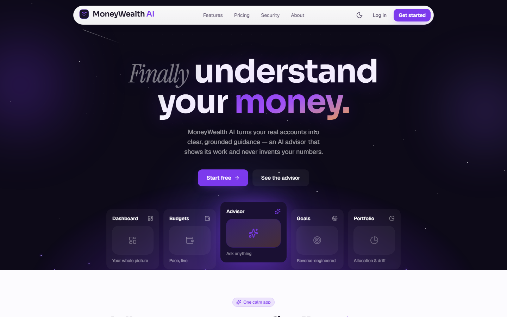
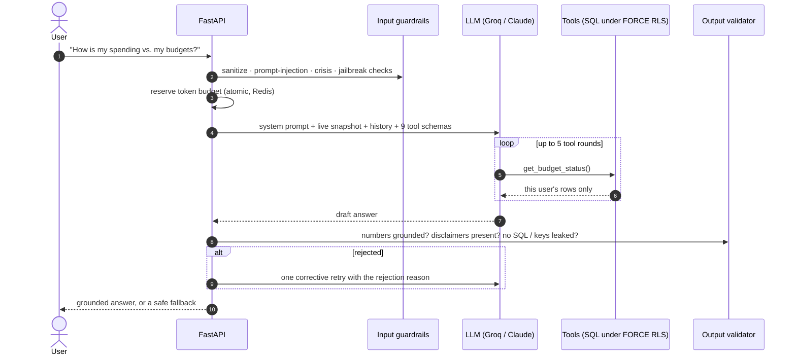
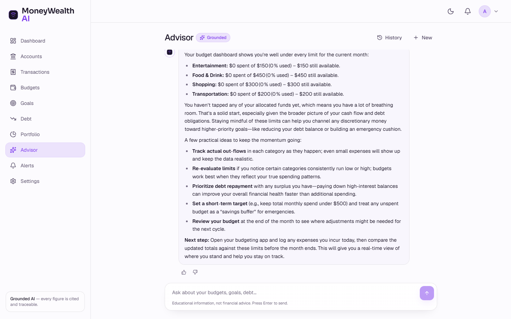
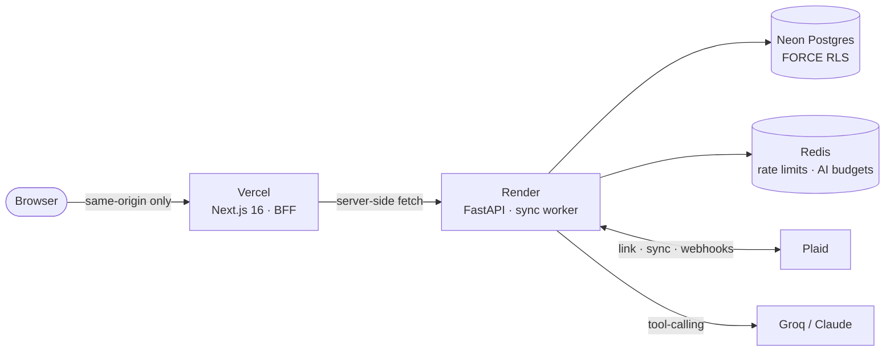
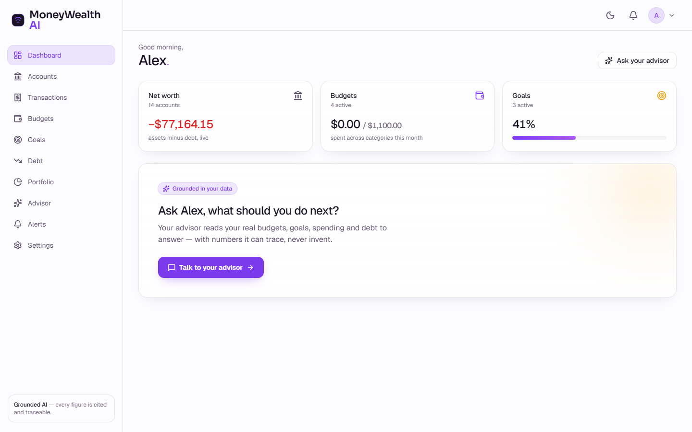
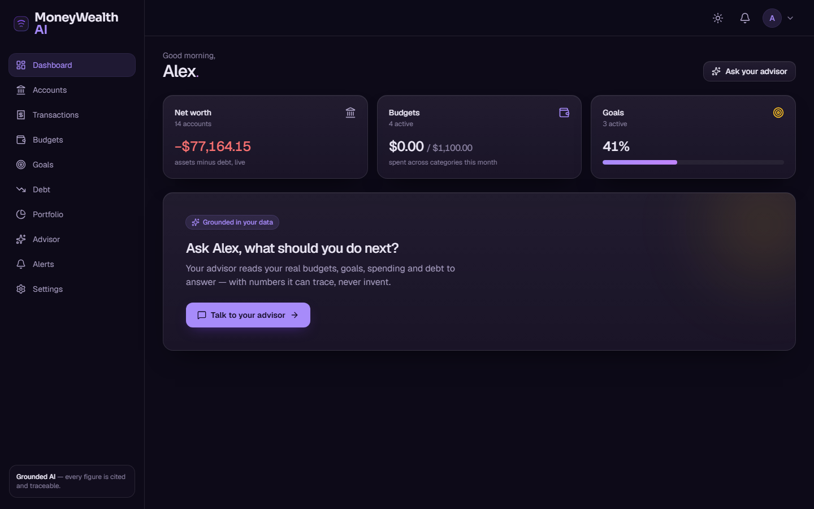
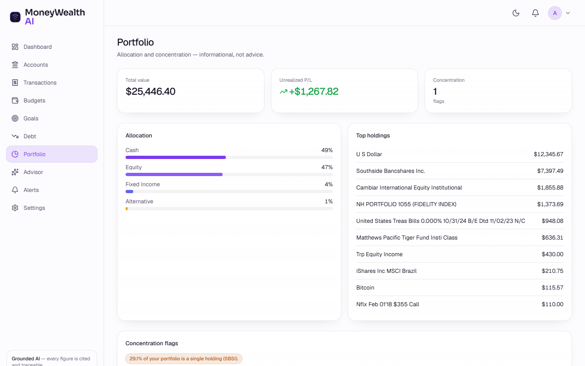
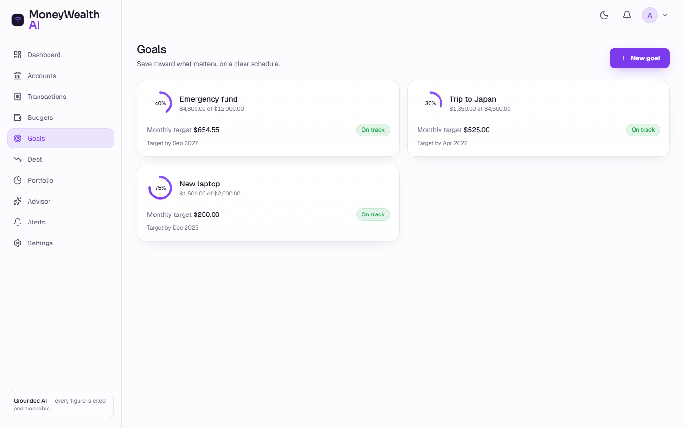
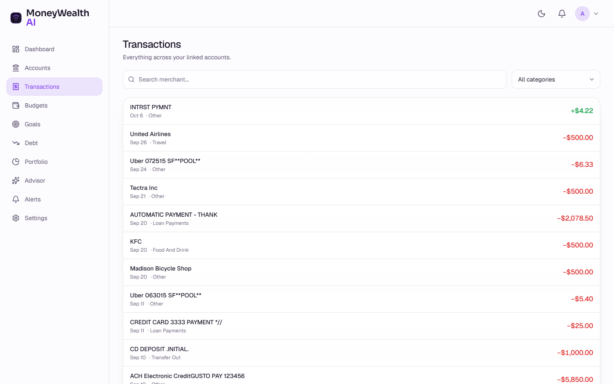

<div align="center">

# MoneyWealth AI

**An AI-native personal finance platform with an agentic LLM advisor that never invents numbers.**

Link real bank accounts, get budgets, goals, debt payoff plans and portfolio insights,
and ask an AI advisor that pulls your live data through tool calls before it answers.

[](https://moneywealth-chi.vercel.app)
[](https://github.com/24pwai0032-gif/FinancialAdvisorAI/actions/workflows/ci.yml)
[](LICENSE)
<br/>


[Live demo](#-try-it) · [How the advisor works](#-the-agentic-advisor) · [Architecture](#-architecture) · [Security](#-security-model) · [Run locally](#-run-it-locally)



</div>

## ✨ Try it

**→ [moneywealth-chi.vercel.app](https://moneywealth-chi.vercel.app)**: log in with the shared demo account:

| Email | Password |
|---|---|
| `demo@example.com` | `MoneyWealthDemo!2026` |

It's preloaded with a Plaid **sandbox** bank: 14 accounts, transactions, a credit card,
student loan, mortgage and an investment portfolio. Try asking the advisor
*"How is my spending tracking against my budgets?"* or *"What are my account balances?"*

> The backend runs on a free tier that sleeps when idle, so the **first request can take ~1 minute**.
> All data is Plaid sandbox data, not real accounts.

## 🧭 What it does

| | |
|---|---|
| 🏦 **Bank linking** | Plaid Link for transactions, liabilities and investments. Access tokens are encrypted with AES-256-GCM; webhooks are signature-verified; syncs run on a durable job queue. |
| 📊 **Dashboards** | Net worth, searchable transactions, budgets with live pace, goals reverse-engineered into monthly targets, debt snowball vs. avalanche what-ifs, portfolio allocation and concentration flags. |
| 🤖 **Agentic AI advisor** | A multi-step tool-calling loop over the user's live data, wrapped in input guardrails, an output validator and per-tier token budgets. See below. |
| 🔔 **Proactive alerts** | Budget, goal, milestone and unusual-transaction alerts with an idempotent dispatcher, an outbox, quiet hours and a preference center. |
| 🛠️ **Admin console** | Users, AI ops (token usage), Plaid ops, feature flags, notification outbox and audit log, built on audited cross-tenant functions. |
| 🎨 **Polished UI** | Light and dark themes, responsive, WCAG-minded, with Playwright + axe accessibility checks. |

## 🤖 The agentic advisor

Most finance chatbots answer from the model's memory. This one **has to fetch the numbers first**.
Every quantitative answer must come from one of **9 tenant-scoped tools**
(`get_account_balances`, `get_spending_summary`, `get_cash_flow`, `get_budget_status`,
`get_goals_status`, `get_debt_summary`, `get_portfolio_summary`, `calculate_affordability`,
`calculate_debt_payoff`), and a validator rejects any reply whose numbers weren't grounded in a tool call.





**What makes it production-grade rather than a demo:**

- **Grounding enforced in code, not just the prompt.** `validate_output` rejects
  `NUMBERS_WITHOUT_TOOL_GROUNDING`, `INVESTMENT_RESPONSE_MISSING_DISCLAIMER`, `SQL_LEAKED`,
  `API_KEY_LEAKED` and length violations. Rejected drafts get one corrective retry, then a safe fallback.
- **Guardrails before the model.** Input sanitization and a prompt-injection filter run first.
  Crisis messages trigger a **crisis protocol** that bypasses the LLM entirely, and a jailbreak
  classifier refuses before any tokens are spent.
- **Tools can't leak other users' data.** They run as a non-owner Postgres role under
  `FORCE ROW LEVEL SECURITY`, so isolation holds even if the model asks for the wrong thing.
- **Cost control.** Each turn reserves tokens atomically against a per-tier daily budget,
  and the reservation is always reconciled (refunded in full on failure).
- **Provider abstraction with failover.** Anthropic Claude and Groq
  (`openai/gpt-oss-120b`) sit behind one interface; the live demo runs on Groq.
- **Evals in CI.** An AI-safety eval corpus (prompt injection, jailbreaks, crisis
  inputs, output-validation cases) gates every push.

## 🏗️ Architecture



- **Backend-for-Frontend:** the browser only talks to Next.js. Route handlers proxy to the
  API server-side, so the access token lives in memory, the refresh token sits in an
  httpOnly first-party cookie, and the API origin is never exposed.
- **Stateless API:** all state is in Postgres and Redis, so the API scales horizontally.
  Background bank syncs use a durable `sync_jobs` queue claimed with `FOR UPDATE SKIP LOCKED`,
  so a fleet of workers never double-processes a job.
- **Raw, parameterized SQL** (asyncpg, no ORM) with forward-only SQL migrations as the schema source of truth.

## 🔒 Security model

- **Multi-tenant isolation in the database:** `FORCE ROW LEVEL SECURITY` on every tenant
  table, tenant **and** per-user policies, and an app role that is `NOBYPASSRLS`.
  The few legitimate cross-tenant paths (queue, webhooks, admin) are narrow, audited
  `SECURITY DEFINER` functions.
- **Auth:** JWT access tokens plus rotating refresh tokens with reuse detection
  (family revoke), bcrypt with pre-hashing, brute-force throttling, anti-enumeration
  responses, optional Cloudflare Turnstile, and a separate admin token audience.
- **Web:** a strict nonce-based CSP with `strict-dynamic`, security headers, a Host
  allowlist and request-size limits.
- **Secrets:** Plaid access tokens are encrypted at rest (AES-256-GCM with associated
  data), and webhook signatures are verified.
- **Supply chain:** dependency audit in CI, plus `bandit` and `pip-audit` passes.

Details: [backend/docs/SECURITY.md](backend/docs/SECURITY.md).

## 📸 Screenshots

| Dashboard (light) | Dashboard (dark) |
|---|---|
|  |  |
| **Portfolio** | **Goals** |
|  |  |
| **Transactions** | **Advisor** |
|  |  |

## 🧰 Tech stack

| Layer | Tech |
|---|---|
| **AI** | Agentic tool-calling loop · Groq (`openai/gpt-oss-120b`) / Anthropic Claude · input guardrails · output validator · eval harness |
| **Backend** | Python 3.11+, FastAPI, asyncpg (raw SQL), Pydantic v2, structlog, Prometheus metrics |
| **Frontend** | Next.js 16 (App Router, RSC, BFF), React 19, TypeScript 5, Tailwind CSS 4, TanStack Query, Radix, zod, motion |
| **Data** | PostgreSQL (FORCE RLS), Redis (rate limits, token budgets), durable job queue |
| **Integrations** | Plaid (transactions, liabilities, investments), Stripe billing (built, not activated) |
| **Infra** | Vercel · Render (Docker) · Neon · GitHub Actions. The AWS path (ECS Fargate, RDS, SSM, Terraform) is included. |
| **Quality** | pytest (unit + integration) · AI-safety evals · ruff · mypy · Vitest · Playwright + axe |

## 🚀 Run it locally

Prerequisites: Docker, Python 3.11+, Node 20+. You'll need a free [Groq API key](https://console.groq.com) and
[Plaid sandbox keys](https://dashboard.plaid.com) for the AI and bank features.

```bash
# 1) Datastores: Postgres on :5433, Redis on :6380
docker compose up -d postgres redis

# 2) Backend: http://localhost:8000/docs
cd backend
cp .env.example .env              # add GROQ_API_KEY, PLAID_CLIENT_ID / PLAID_SECRET / PLAID_ENC_KEY,
                                  # and set SYNC_WORKER_ENABLED=true to sync banks in-process
python -m venv .venv && source .venv/bin/activate   # Windows: .venv\Scripts\activate
pip install -r requirements-dev.txt
python -m scripts.migrate
uvicorn app.main:app --reload --port 8000

# 3) Frontend: http://localhost:3100
cd ../frontend
npm install
printf "API_BASE_URL=http://localhost:8000\nNEXT_PUBLIC_APP_URL=http://localhost:3100\n" > .env.local
npm run dev
```

With `MAIL_TRANSPORT=console`, the email verification link is printed in the backend log.
Bank linking requires a verified email.

## 🧪 Testing

```bash
cd backend  && ruff check . && mypy app && pytest && python -m scripts.run_evals
cd frontend && npm run lint && npm test && npm run build    # npm run test:e2e with the stack running
```

CI ([ci.yml](.github/workflows/ci.yml)) runs on every push and PR. It runs lint, type checks,
the backend tests, the **AI-safety eval gate**, a dependency audit, and the frontend lint,
tests and build.

## ☁️ Deployment

| Guide | Stack |
|---|---|
| [docs/deployment.md](docs/deployment.md) | **Vercel + Render + Neon** (how the live demo runs; free tier; [`render.yaml`](render.yaml) Blueprint) |
| [docs/deploy-aws.md](docs/deploy-aws.md) | **AWS ECS Fargate + RDS** with Terraform ([`infra/terraform/`](infra/terraform/)): VPC, ALB, autoscaling |
| [docs/email-setup.md](docs/email-setup.md) | Transactional email: Gmail SMTP, Amazon SES or SendGrid |

## 📁 Repository layout

```
.
├── backend/                 FastAPI app: auth, plaid, ai, budgets, goals, debt, portfolio, alerts, admin
│   ├── app/ai/              agent loop, tools, guardrails, validator, providers, token budgets
│   ├── db/migrations/       forward-only SQL: schema, FORCE RLS, SECURITY DEFINER functions
│   ├── tests/               unit, integration, load, and evals/ (AI-safety corpus)
│   └── docs/                architecture, security, DR runbook, build phases
├── frontend/                Next.js 16: marketing site, app (10 surfaces), admin console, BFF routes
├── infra/terraform/         AWS stack as code
├── docs/                    deployment guides and screenshots
├── render.yaml              Render Blueprint (API + Redis)
└── docker-compose.yml       local Postgres + Redis (+ optional API container)
```

## 🗺️ Status

- ✅ Auth, Plaid data layer, agentic advisor + safety stack, planning (budgets, goals, debt, portfolio),
  proactive alerts, admin console, observability: [backend/docs/](backend/docs/)
- ✅ Deployed on Vercel + Render + Neon with CI on every push
- ⏭️ Built and config-ready, but not switched on in the demo: transactional email, Google sign-in,
  Stripe billing, Cloudflare Turnstile
- ⏭️ Before real users: production Plaid access, legal review of disclosures

## 📄 License

[MIT](LICENSE)

---

<div align="center">
<sub>Built by <a href="https://github.com/24pwai0032-gif">@24pwai0032-gif</a> · Educational information, not financial advice.</sub>
</div>
